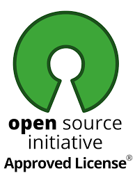

<p align="center">
    
</p>
<p align="center">
    <a href="https://twitter.com/amanraj_Phunish">
    </a>
    <a href="#"></img></a>
    <a href="https://opensource.org/licenses/MIT"></a>
    <br>
    <a href="https://www.python.org/"></a>
    <a href="https://en.wikipedia.org/wiki/Linux"></a>
    <a href="https://youtube.com/"></a>
    <a href="https://github.com/amanraj-bose/Network-Framework/releases/tag/v0.2.0"></img></a>
    <br>
    
 </p>

# Network-Framework

**_THIS TOOL USING FOR GATHERING INFORMATION FROM ANY WEBSITES, Email Address, and Phone Number._**

`Note :` Enter url without www example: https://example.com/

## Platform Support & Tested
- Linux
    - Kali Linux
    - Ubuntu Linux
    - Debian Linux
    - Parrot Linux
- Android
    - Termux
## Fetching Tool From github

```sudo apt install git or apt install git```
#             
```git clone https://github.com/amanraj-bose/Network-Framework.git```
#
```cd Network-Framework```

## Installation
- <mark>**Linux**</mark>
    - Automatic Installation
        - Sign Up For API Key ` https://ipinfo.io/ ` and ` https://opencagedata.com/users/sign_in#geocoding `
        - Paste on ` config/config.json `
            - ```
                {
                "key": {
                    "ipinfo": "<API KEY>",
                    "opengrab": "<API KEY>"
                    },
                "Profile":{
                    "name": "",
                    "Install-Date": ""
                    },
                "links":{
                    "ip-Info": "https://ipinfo.io/",
                    "opencage": "https://opencagedata.com/"
                    },
                "termux-url": {
                "hacker-target": "http://api.hackertarget.com/",
                "ip-Info": "https://ipinfo.io/"
                    },
                }
                ```
        - Script Permission ` chmod u+x install.sh ` or ` chmod +x install.sh `

        - Run ` sh install.sh ` if any error occurs ` ./install.sh `
            
    - Manual Installation
        - Sign Up For API Key ` https://ipinfo.io/ ` and ` https://opencagedata.com/users/sign_in#geocoding `
        - Paste on ` config/config.json `
            - ```
                {
                "key": {
                    "ipinfo": "<API KEY>",
                    "opengrab": "<API KEY>"
                    },
                "Profile":{
                    "name": "",
                    "Install-Date": ""
                    },
                "links":{
                    "ip-Info": "https://ipinfo.io/",
                    "opencage": "https://opencagedata.com/"
                    },
                "termux-url": {
                "hacker-target": "http://api.hackertarget.com/",
                "ip-Info": "https://ipinfo.io/"
                    },
                }
                ```
        - Package Installation
            - ` sudo apt install python3 -y `
            - ` sudo apt install python3-pip -y `
            - ` sudo apt install php -y `
            - ` sudo apt install rustc -y `
            - ` sudo apt install cargo -y `
            - ` sudo apt install sox -y `
        
        - Module Installation
            ` sudo pip3 install -r requirements.txt `

- <mark>**Termux ( ANDROID )**</mark>
    - Automatic Installation
        - Sign Up For API Key ` https://ipinfo.io/ `
        - Paste on ` config/config.json `
            - ```
                {
                "key": {
                    "ipinfo": "<API KEY>",
                    "opengrab": ""
                    },
                "Profile":{
                    "name": "",
                    "Install-Date": ""
                    },
                "links":{
                    "ip-Info": "https://ipinfo.io/",
                    "opencage": "https://opencagedata.com/"
                    },
                "termux-url": {
                "hacker-target": "http://api.hackertarget.com/",
                "ip-Info": "https://ipinfo.io/"
                    },
                }
                ```
        - Script Permission ` chmod u+x install.sh ` or ` chmod +x install.sh `
        - Run ` sh install.sh ` if any error occurs ` ./install.sh `
    
    - Manual Installation
        - Sign Up For API Key ` https://ipinfo.io/ `
        - Paste on ` config/config.json `
            - ```
                {
                "key": {
                    "ipinfo": "<API KEY>",
                    "opengrab": ""
                    },
                "Profile":{
                    "name": "",
                    "Install-Date": ""
                    },
                "links":{
                    "ip-Info": "https://ipinfo.io/",
                    "opencage": "https://opencagedata.com/"
                    },
                "termux-url": {
                "hacker-target": "http://api.hackertarget.com/",
                "ip-Info": "https://ipinfo.io/"
                    },
                }
                ```
        - Package Installation
            - ` pkg install python3 -y `
            - ` pkg install php -y `
        
        - Module Installation
            ` pip3 install -r requirements.txt `
#
### Module List
- Python Modules
    - requests
    - beautifulsoup4
    - httpx
    - trio
    - holehe
    - phonenumbers
    - geopy
    - pyfiglet
    - termcolor
    - dnspython
    - simplejson
    - bs4
    - argparse
    - opencage


## Usages
```    
root@Ubuntu $: python3 network.py --help

usage: network.py [-h] [--author AUTHOR] [--version] [--no_banner NO_BANNER]

Copyright (c) 2022 to 2030 and it has created by Aman Raj. Our github account is https://github.com/amanraj-
bose/,every options have to arguments.

optional arguments:
  -h, --help            show this help message and exit
  --author AUTHOR, -a AUTHOR
                        For Seeing Author Name
  --version, -v         show program's version number and exit
  --no_banner NO_BANNER, -q NO_BANNER
                        Starting Network Without Banner using this arguments none. example: python3 network.py -q none

```

## Description

 ```
    -h, --help            show this help message and exit.
    --author, -a AUTHOR   For Seeing Author Name.
    --version, -v         show program's version number and exit.
    --no_banner, -q       For No Banner Starting. 
 ```

 - Keywords

```
    Name                    Description
    ----                    -----------

    None                 using with --no_banner or -q

```

## Examples

```
root@Ubuntu $: python3 network.py -q none 
```

<video src="https://user-images.githubusercontent.com/88227750/178748824-0c2ef687-666c-40d1-a623-19b5232af3bc.mp4" width="800">
</video>


## Features
- Email Verifier Scan
- Email Domain Scan
- Email Social Media Scan
- IP Info Finder
- IP Geolocation Finder
- Website Domain Scan
- Website IP Scan
- Website Geolocation
- Content-type Scan
- Website Header Scan
- Website Link Scan
- Subdomain Scan
- CMS Scan
- Phone Number Scan
- Website Tag Capturing
- Website URL Scraping

<!-- ## Tools List and Features

- HoneyPot
    - HoneyPot is a tool which can extract the information of Attacker.

- Email scanner
    - Email Scanner is a osint tool which can find the email address on Pouplar Social Media Sites.
    - Included Tools
        - Email Verifier
        - Email Domain
        - Email Social Media
        - Site List
            - Instagram
            - Twitter
            - Github
            - Spotify
            - Petrone
            - Pinterest
            - WordPress
            - Quora
            - Google
            - Yahoo
            - Flickr
            - Nike
            - Docker
            - Amazon
            - Samsung
            - PS

- Ip Locate -->

<!-- - ip_locate -->

## Update's

`Patch Update on Beta Version 1 month ago`

## Update-Process

- ****Unistall the network tool****
- **reinstall it**

## author
- [@Aman Raj](https://github.com/amanraj-bose)

## License
<p align="center">
    </img>

```
                    GNU GENERAL PUBLIC LICENSE
                       Version 3, 29 June 2007

 Copyright (C) 2007 Free Software Foundation, Inc. <https://fsf.org/>
 Everyone is permitted to copy and distribute verbatim copies
 of this license document, but changing it is not allowed.

                            Preamble

  The GNU General Public License is a free, copyleft license for
software and other kinds of works.

  The licenses for most software and other practical works are designed
to take away your freedom to share and change the works.  By contrast,
the GNU General Public License is intended to guarantee your freedom to
share and change all versions of a program--to make sure it remains free
software for all its users.  We, the Free Software Foundation, use the
GNU General Public License for most of our software; it applies also to
any other work released this way by its authors.  You can apply it to
your programs, too.

  When we speak of free software, we are referring to freedom, not
price.  Our General Public Licenses are designed to make sure that you
have the freedom to distribute copies of free software (and charge for
them if you wish), that you receive source code or can get it if you
want it, that you can change the software or use pieces of it in new
free programs, and that you know you can do these things.

  To protect your rights, we need to prevent others from denying you
these rights or asking you to surrender the rights.  Therefore, you have
certain responsibilities if you distribute copies of the software, or if
you modify it: responsibilities to respect the freedom of others.

  For example, if you distribute copies of such a program, whether
gratis or for a fee, you must pass on to the recipients the same
freedoms that you received.  You must make sure that they, too, receive
or can get the source code.  And you must show them these terms so they
know their rights.

  Developers that use the GNU GPL protect your rights with two steps:
(1) assert copyright on the software, and (2) offer you this License
giving you legal permission to copy, distribute and/or modify it.

  For the developers' and authors' protection, the GPL clearly explains
that there is no warranty for this free software.  For both users' and
authors' sake, the GPL requires that modified versions be marked as
changed, so that their problems will not be attributed erroneously to
authors of previous versions.

  Some devices are designed to deny users access to install or run
modified versions of the software inside them, although the manufacturer
can do so.  This is fundamentally incompatible with the aim of
protecting users' freedom to change the software.  The systematic
pattern of such abuse occurs in the area of products for individuals to
use, which is precisely where it is most unacceptable.  Therefore, we
have designed this version of the GPL to prohibit the practice for those
products.  If such problems arise substantially in other domains, we
stand ready to extend this provision to those domains in future versions
of the GPL, as needed to protect the freedom of users.

  Finally, every program is threatened constantly by software patents.
States should not allow patents to restrict development and use of
software on general-purpose computers, but in those that do, we wish to
avoid the special danger that patents applied to a free program could
make it effectively proprietary.  To prevent this, the GPL assures that
patents cannot be used to render the program non-free.

  The precise terms and conditions for copying, distribution and
modification follow.
```
</p>

## Copyright
<mark>**©️ Copyright 2022 Aman Raj. All rights reserved.**</mark>


<hr>

# Special Thanks to Thumb Group

> **special thanks to Thumb Group for their support**
